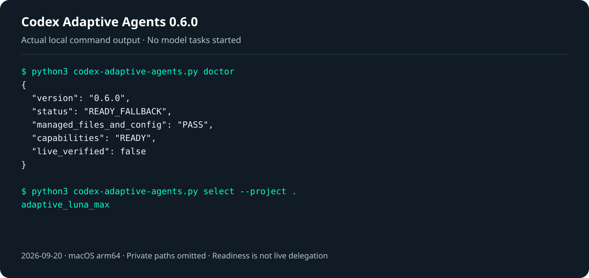

# Codex Adaptive Agents 0.7.0

[简体中文](README.zh-CN.md)

Codex Adaptive Agents is a small Python runtime and installer for the official
Codex CLI. It lets the Astra root agent choose a bounded Luna role when a task
is worth delegating, while the official Codex client keeps ownership of login,
provider access, and model execution.

Installation, policy selection, and verification are implemented in this
repository. No other agent-orchestration project is required. See the
[implementation and dependency details](docs/UPSTREAM.md).

After installation, continue to describe work in ordinary Codex tasks. Astra
plans and reviews the work, while 0–5 native Luna children take clearly bounded
substantive work packages with explicit ownership and acceptance. The package
adds configuration and scripts to Codex; it has no separate chat window and
installs no background service or MCP server.

## Easiest setup: copy these prompts into Codex

Use a Codex client that can access your local files and run commands. Ask it to
install the project, then open a new task to verify the installation; use the
third prompt when an existing installation needs an upgrade. Manual commands
are also included below.

### Step 1: ask Codex to install

This sets GPT-6 Luna child defaults at `xhigh`, five roles, and project
instructions while preserving your main model, reasoning level, and unrelated
configuration.

```text
Install Codex Adaptive Agents for me from its project repository:
https://github.com/aweiht/codex-adaptive-agents
Preserve existing edits. Read the repository README.md, use this Codex client's existing CODEX_HOME, and run the checkout's exact codex-adaptive-agents.py entry with Python 3.11+ (`python3 codex-adaptive-agents.py` on macOS/Linux or `py -3 .\codex-adaptive-agents.py` on Windows).
Install the managed Codex Adaptive Agents runtime, five adaptive_luna_* roles, and instructions while preserving unrelated settings, roles, backups, and files.
Run `install --dry-run`, review the plan, then apply exactly the returned plan with `install --yes --plan-id <plan_id>`. Run `doctor`; refresh only if its capability snapshot or policy cache is stale, then check doctor once more.
Complete the installation and report the source path, CODEX_HOME, plan result, and doctor status. Accept success only when installation completes and doctor is READY or READY_FALLBACK. Do not run verify --live or any model task in this step. Explain any dependency, login, permission, or conflict that needs attention.
```

### Step 2: open a new Codex task and verify

This checks the local installation and role selection without starting an
extra model test. `READY` or `READY_FALLBACK` plus a successful selection means
the local installation check passed.

```text
Verify my Codex Adaptive Agents installation:
https://github.com/aweiht/codex-adaptive-agents
Use this Codex client's existing CODEX_HOME and locate `CODEX_HOME/codex-adaptive-agents/runtime/codex-adaptive-agents.py`. With Python 3.11+ (`python3` on macOS/Linux or `py -3` on Windows), run `python3 "$CODEX_HOME/codex-adaptive-agents/runtime/codex-adaptive-agents.py" --codex-home "$CODEX_HOME" doctor` (or the equivalent `py -3` command) through that installed entry, then run `select --project <temporary-directory> --explain` in a separate temporary directory.
Refresh only when doctor reports a stale capability snapshot or policy cache, and check doctor again. Confirm that selection returns an installed `adaptive_luna_*` role.
Do not reinstall, change business files, run verify --live, call a model, or treat selection as a child-agent invocation. Report “local installation check passed” only when doctor is READY or READY_FALLBACK and selection succeeds; include the actual status, selected role, and any failure reason.
```

### Step 3: ask Codex to upgrade an existing installation

Use this when the installed runtime was copied from an earlier source checkout
or ZIP. The managed runtime path stays the same; updating a checkout alone does
not update that copied runtime.

```text
Upgrade my existing Codex Adaptive Agents installation from its project repository:
https://github.com/aweiht/codex-adaptive-agents
Use the current Codex client's CODEX_HOME and existing installation. Get the newest source from the repository's default branch and read its VERSION. If the current checkout has dirty edits, preserve them and use a separate fresh checkout for the upgrade. Set `origin` to `https://github.com/aweiht/codex-adaptive-agents.git` or use a new checkout. If the source came from a ZIP, fetch and extract a fresh archive from this repository instead of depending on the old download directory.

Run the source checkout's exact `codex-adaptive-agents.py` entry with Python 3.11+ and the existing CODEX_HOME (for example, `python3 codex-adaptive-agents.py --codex-home "$CODEX_HOME" ...`). Obtain and review `install --dry-run`, then apply exactly its returned plan with `install --yes --plan-id <plan_id>`. If a managed conflict needs attention, stop and report it. Create the normal backup and preserve unrelated settings, roles, instructions, and files. Do not uninstall first or create a second installation; use this plan to update the existing installation.

Afterward verify the source with `codex-adaptive-agents.py --version`, verify the installed entry at `CODEX_HOME/codex-adaptive-agents/runtime/codex-adaptive-agents.py` with `--version`, and run installed `doctor`. Refresh only if the capability snapshot or policy cache is stale. Accept the upgrade only when the source and installed versions report the expected version and doctor is READY or READY_FALLBACK. Do not run verify --live or any model call. Report the source path, installed runtime path, backup, update result, doctor status, and any conflict.
```

To check whether Luna can actually execute tasks, use the separate
[optional live verification](#optional-live-verification), which uses real
Codex allowance.

## How the route works


_The workflow shows installation, daily policy selection, and bounded native
delegation. It is a usage overview, not evidence of a live model run._

The installer manages a small, explicit scope in the user's Codex home:

- Your main model and reasoning level remain under your control. Installation
  and upgrades preserve the existing main settings.
- GPT-6 Luna is configured as the default subagent: `gpt-6-luna` at `xhigh`.
- Five role files are installed: `adaptive_luna_low`, `adaptive_luna_medium`,
  `adaptive_luna_high`, `adaptive_luna_xhigh`, and `adaptive_luna_max`.
- A daily policy cache chooses one of those roles from the local public model
  catalogue and the two public radar sources. No model call is used for this
  selection.

The installer changes the managed `agents` keys intentionally. It
preserves unrelated configuration, roles, MCP settings, hooks, and other files
outside that managed scope. Every write is planned, backed up, written
atomically, and verified; a conflicting managed change stops the transaction.

## Requirements

You need all of the following before applying an installation:

- Python 3.11 or newer. The runtime uses only the Python standard library; no
  pip package, Go compiler, or compiled binary is required.
- The official Codex CLI 0.147.0 or newer.
- A Codex client that supports native custom agents. Normal use and live
  verification require model access and available account allowance.
- A normally configured official Codex home and account whose public catalogue
  exposes `gpt-6-astra` with `max`, plus `gpt-6-luna` with all five levels:
  `low`, `medium`, `high`, `xhigh`, and `max`.

The installer reads the CLI's public version and model catalogue through
`codex --version` and `codex debug models`. It does not open authentication
files. A clone or downloaded ZIP does not guarantee that an account can use
the required models. A blank or isolated `CODEX_HOME` may have no matching
catalogue, in which case `install --yes` correctly refuses to proceed.

## Quick start

Clone the public repository and enter it. Alternatively, use GitHub's
**Code → Download ZIP**, extract the archive, and open a terminal there.
If Codex is not ready yet, follow the
[official CLI setup](https://developers.openai.com/codex/cli/) first:

```sh
git clone https://github.com/aweiht/codex-adaptive-agents.git
cd codex-adaptive-agents
```
On macOS or Linux, use `python3`:

```sh
python3 --version                 # must be 3.11 or newer
python3 codex-adaptive-agents.py install --dry-run
python3 codex-adaptive-agents.py install --yes
python3 codex-adaptive-agents.py doctor
```

On Windows PowerShell, use the Python launcher. Make sure `py -3` resolves to
Python 3.11 or newer:

```powershell
py -3 --version
py -3 .\codex-adaptive-agents.py install --dry-run
py -3 .\codex-adaptive-agents.py install --yes
py -3 .\codex-adaptive-agents.py doctor
```

`install --dry-run` prints the planned managed changes and does not write them.
`--dry-run` is supported only for `install` and `uninstall`; other commands
reject it before execution, including `verify --live` and `refresh`.
`install --yes` applies the planned changes after checking the official CLI
and required public catalogue. If your Codex home is not the default, pass it
before the subcommand, for example:

```sh
python3 codex-adaptive-agents.py --codex-home "/path/to/.codex" install --dry-run
python3 codex-adaptive-agents.py --codex-home "/path/to/.codex" install --yes
```

After a successful `INSTALLED` result, open a new Codex task. Existing tasks
may still hold their startup instructions from before installation.

The installed entry point is
`<CODEX_HOME>/codex-adaptive-agents/runtime/codex-adaptive-agents.py`, so the download directory
can be moved later. Keep the Python interpreter path used during installation
available; the managed instructions refer to it.

## Use it in Codex

Open your project in a new Codex task and describe the outcome you need. For
example:

> Check this project's input validation and test coverage. Delegate useful,
> independent work to Luna, then review the changes and report the verification.

You do not need to start a worker or run the selector yourself. Before
substantive work starts, Astra does only enough exploration to identify the
boundary, then decides the route. Independent work can run in parallel, with
at most five direct Luna children in one task. Before a delegation batch, the
managed instructions call the daily selector; external rankings are only a
selection aid and do not guarantee lower token use, speed, or task quality.

### Delegation gate

Astra owns requirements, key decisions, public interfaces, coordination, and
final acceptance. A safe work package with an explicit goal, boundary, artifact
or problem ownership, and checkable acceptance must be handed to a native Luna
child when the host permits it, before that package starts. This is a trial
routing policy: it makes no
promise of lower token usage or faster completion, sets no total-cost or
elapsed-time threshold, uses no 2:8 (or other) delegation ratio, and adds no
usage-collection system. An explicit user request to delegate is honored within
the host's permissions; the root does not merely describe a split or add a
child after the work is complete.

A full feature or UI diagnosis is one work package: the same child carries it
through implementation, local tests, and ordinary failure repair. A normal
failure returns to that child for repair. Escalate to Astra when the repair
requires a public-interface change or major design decision, the failure stays
unresolved after reasonable repair, or a capability or permission limit blocks
the package. Astra independently checks cross-module integration and
high-risk permission, data, or process behavior before final acceptance.

Long tests, polling, sampling, and ordinary failure handling stay in that same
Luna package. Scripts or native waits perform ongoing monitoring. Astra's
normal review reads the handoff summary, relevant diff, and specific artifacts
without repeating the same full exploration or tests; it expands checks only
for completion, a clear exception or threshold, a pending decision, or a risk
signal.

Direct completion is suitable for a simple question, a genuinely one-off small
change, a root-only decision, a tightly coupled dependency chain with no safe
independent boundary, or an explicit no-delegation request. Do not split a
substantive batch into small edits to avoid this assessment. Independent
packages may run in parallel; dependent packages run serially. Shared GUI,
database, port, or build-output resources have one owner and are serialized
when needed; a resource constraint does not by itself cancel a valid work
package. A task uses no more than five direct Luna children, and agents are not
started merely to satisfy a ratio or create duplicate work.

If the user specifies a worker count or parallel arrangement that cannot be met
safely, explain the constraint and ask to adjust it; do not silently change the
request. The root may take work back when an escalation condition applies and
should state the reason.

| Situation | Route |
| --- | --- |
| Simple question, one small edit, or root-only decision | Complete directly |
| Complete feature or UI diagnosis with clear ownership and acceptance | Delegate the full implementation, local tests, and ordinary repairs to one child |
| Independent work packages with separate resources | Delegate; run in parallel when safe |
| Dependent packages or shared GUI, port, or build directory | Delegate; use serial order with one resource owner |
| Cross-module integration or high-risk permission, data, or process behavior | Child performs the package; root performs the independent integration/risk check |
| Public-interface change, major design decision, repeated unresolved failure, or capability/permission block | Escalate to the root |
| The user explicitly says not to delegate | Complete directly |

Reassess unfinished work when the scope expands, the original plan no longer
fits, troubleshooting repeats, or the task enters a new implementation or
verification phase. The root may take work back when an escalation condition
applies, and should state the reason. The daily selector only chooses a
supported role level; it does not decide whether to delegate or spawn agents,
and it is not a timer or scheduler. If the selector, role, or native tool
fails, report the actual returned error. Do not claim that a capability is
unavailable without evidence, and do not treat successful selection as a
child-agent invocation. These are instructions for the agent, not a
host-enforced guarantee of delegation.

The final reply includes a compact execution summary, for example:

```text
Astra/Luna: direct · luna ×0
Astra/Luna: delegated · luna_max ×2 · parallel
```

These examples show the format, not a live run. Child levels and counts come
from actual dispatches; the root displays its known model name only. The
summary does not read or report the current window's reasoning-effort setting.
Each package states its full goal, boundary, ownership, acceptance checks, and
the local context needed to do the work. Prefer bounded, history-free handoffs
without unrelated history. The execution owner reports startup once, delivers
once, and reports exceptions, thresholds, or decisions when they arise. If an
interim user update is required, use known state; do not reread unchanged logs
or snapshots to produce it. A native wait timeout ends only that wait interval
and does not remove any host turn. The child returns five concise points:
completed work, file or artifact locations, verification evidence, unresolved
issues, and pending decisions. Keep detailed logs at the agreed local path for
on-demand reading; do not omit failures or risks. The root waits on the same
native task and works only on different, non-overlapping work while it runs.
State the delegation or direct-completion reason in one sentence in the plan or
progress update. Keep this compact footer and do not create a separate
delegation report file.

### Temporary process and long command runs

Ordinary short commands need no process ledger. For a temporary service or a
bounded long command, the root creates one isolated run and passes its `run_id`,
project, entry point, owner, purpose, and resource or port boundary to each
child. Use `--summary --timeout <seconds>` for a long test: the completion
summary gives status, exit result, registered run/entry identifiers and PID,
captured byte counts, and private log paths, without stdout/stderr text.
Without `--summary`, the original completion JSON with output text remains
available. Combined stdout and stderr capture is capped at 2 MiB; exceeding the
cap fails and can leave partial logs. Treat `output_complete=false` as partial
evidence. The command or native wait owns ongoing monitoring; do not repeat
`process-check` without a state change, but make a targeted check for an
exception, identity doubt, or lost supervision. The child reports startup
`entry_id` and PID once, stops its own command or execution session, and reports
explicitly retained work as `RETAINED`; the root performs the final check,
cleanup, and post-cleanup check. The run rejects new commands after cleanup,
while retained entries can be checked or cleaned again in the same run. See the [public
process operations guide](docs/PUBLIC_GUIDE.md#temporary-process-and-long-command-runs)
for copyable POSIX and PowerShell commands, output semantics, and limits.

## Installation scope and backups

The transaction may add or update these owned paths under the selected Codex
home:

- managed keys in `config.toml`;
- one marked, managed block in `AGENTS.md`;
- the five `agents/adaptive_luna_*.toml` role files;
- the runtime, installation receipt, capability snapshot, transaction journal,
  and private backups under `codex-adaptive-agents/`.

Backups are kept under
`$CODEX_HOME/codex-adaptive-agents/backups/` (or the equivalent Windows Codex
home). The receipt records hashes and the exact managed configuration changes.
The installer refuses to overwrite an unrelated change discovered during the
transaction, and rollback refuses to overwrite a newer concurrent change.

## Status and troubleshooting

`doctor` performs an offline post-install check. It checks managed hashes, the
installed entry point, the official CLI version, the saved public capability
snapshot, and the local policy cache. It does not call a model.

- `READY` means the installation and current local capability/policy state are
  usable.
- `READY_FALLBACK` means the installation is usable with the supported
  `xhigh` role because usable, comparable GPT-6 Luna radar scores were
  unavailable (including missing model rows or failed website requests).
  Run `refresh` when the public sources are available; this status does not
  claim that a dynamic recommendation was proven.
- `NOT_READY` means the installation is absent or a required check failed. A
  clean Codex home normally reports this status.

Use the matching repair path:

- **Codex is missing or too old:** install or update the official CLI, run its
  normal `codex login`, then rerun `doctor`. If `codex` is not on `PATH`, pass
  `--codex /absolute/path/to/codex` to `install`, `doctor`, or `refresh`.
- **The public catalogue is missing Astra/Luna:** run `codex debug models` in
  the Codex home you intend to use. The required Astra Max and all five Luna
  levels must be present before `install --yes` can write anything. An empty
  isolated home cannot be used as a substitute for a working account.
- **The policy is stale or blocked:** refresh the public snapshot and inspect
  the selected role:

  ```sh
  python3 codex-adaptive-agents.py refresh --project /path/to/project
  python3 codex-adaptive-agents.py doctor
  python3 codex-adaptive-agents.py select --project /path/to/project --explain
  ```

- **A managed conflict is reported:** keep the user's changed files, review
  the `install --dry-run` plan, and rerun after resolving the intended managed
  values. If a transaction was interrupted, use `recover --yes`; it restores
  only the recorded transaction when its hashes still match.
- **A task does not use the new route:** start a new Codex task after the
  install. The managed block is loaded when a task starts.

To inspect the selected role, use `select`:

```sh
python3 codex-adaptive-agents.py select --project /path/to/project
python3 codex-adaptive-agents.py select --project /path/to/project --explain
```

`select` chooses a role and does not start a child agent. The project policy
cache lives in `.codex-adaptive-agents/state`; add `.codex-adaptive-agents/` to
the project's ignore file. `select` may refresh once per local day. `refresh`
explicitly updates the public capability snapshot and policy inputs. Use
`refresh --project /path/to/project` to retry that project immediately after a
same-day failure; plain `refresh` updates the home-level policy. Neither
command invokes a model.



_This SVG presents actual `doctor` and `select` output from a local 0.7.0
installation captured on 2026-09-23, with private paths omitted. It shows local
checks; it is not a Codex screenshot or evidence of a live model task._

## Optional live verification

Process cleanup has platform-specific limits, especially rapidly double-forked
processes on macOS. See the [process cleanup boundary](docs/PUBLIC_GUIDE.md#process-cleanup-boundary).

For a real native task check, copy this prompt into Codex:

```text
Please run one live native-delegation check for my Codex Adaptive Agents installation:
https://github.com/aweiht/codex-adaptive-agents
I authorize this verify --live run to use real Codex allowance: at most two direct Luna children, a 600-second limit, and no automatic retry.
Use the installed `CODEX_HOME/codex-adaptive-agents/runtime/codex-adaptive-agents.py` entry with Python 3.11+. Run doctor first, then run verify --live only if doctor passes.
Let the command create its default isolated temporary verification directory; preserve the results and do not use an existing business directory.
Inspect the command result and artifacts. Report a live pass only for LIVE_VERIFIED; otherwise explain the failure. Do not substitute role selection or model self-reports for execution evidence.
Give the local result, live result, and evidence-file location.
```

Offline tests and live model verification are separate checks. Run the offline
tests without consuming model allowance:

```sh
python3 -m unittest discover -s tests_python -p 'test_*.py' -v
```

On Windows PowerShell:

```powershell
py -3 -m unittest discover -s tests_python -p "test_*.py" -v
```

Only when you have a working account and want to spend real Codex allowance,
run the explicit live check:

```sh
python3 codex-adaptive-agents.py verify --live \
  --project /path/to/smoke-project \
  --output /path/to/verification-output
```

The command uses a temporary official stdio test channel, starts at most two
direct native Luna children, and is bounded at 600 seconds. A complete,
independently checked run returns `LIVE_VERIFIED`. It may consume real quota;
do not treat it as a default installation step. The temporary channel is not
an installed MCP server, daemon, Hook, scheduler, or resident process.

## Validation boundary

The current 0.7.0 evidence is revision- and environment-specific. No new live
model verification was requested for this revision, and no historical CI run
proves the current source. See [docs/VALIDATION.md](docs/VALIDATION.md) for the
current local boundary and the earlier published CI result tied to its exact
commit.

## Update, recovery, and uninstall

Use the upgrade prompt above for a reviewable in-place upgrade. A Git checkout
must point at the canonical repository before it is refreshed:

```sh
git remote set-url origin https://github.com/aweiht/codex-adaptive-agents.git
git pull --ff-only
python3 codex-adaptive-agents.py --version
python3 codex-adaptive-agents.py install --dry-run
python3 codex-adaptive-agents.py install --yes --plan-id <plan_id>
python3 "$CODEX_HOME/codex-adaptive-agents/runtime/codex-adaptive-agents.py" --codex-home "$CODEX_HOME" --version
python3 "$CODEX_HOME/codex-adaptive-agents/runtime/codex-adaptive-agents.py" --codex-home "$CODEX_HOME" doctor
```

`git pull` updates only the checkout; it does not update the copied installed
runtime. The upgrade uses the existing CODEX_HOME and runtime path, creates a
backup, and preserves unrelated settings and roles. A managed conflict requires
attention. There is no need to uninstall or reinstall, and there is no automatic
or self-update command. ZIP users should fetch and extract a fresh archive from
the repository; the previous download directory is not an upgrade source. New
model support arrives through maintainer releases, so arbitrary future models
are not promised to work automatically.

Use the same entry point and Codex home:

```sh
python3 codex-adaptive-agents.py uninstall --dry-run
python3 codex-adaptive-agents.py uninstall --yes
python3 codex-adaptive-agents.py recover --yes
python3 codex-adaptive-agents.py rollback --backup PATH --yes
```

`uninstall --yes` removes the owned runtime and managed role files, reverts the
managed instruction block and configuration changes, and preserves unrelated
user changes. Files and empty configuration tables created by this installation
are removed only while they contain no later user additions. Backup history
remains available under the resource directory. `recover` only restores an
interrupted journal marked `applying`; it refuses a completed installation.
To reverse a completed transaction, explicitly use `rollback --backup PATH --yes`
with the backup path recorded by that transaction. `recover` does not accept
`--backup`, and `rollback` requires it.

## Build and license

The release builder uses the checked-in allowlist and refuses unsafe archive
members, broken public Markdown links, private paths, and overwriting an
existing archive:

```sh
python3 scripts/release_python.py --output-dir dist/0.7.0-python
```

The project is distributed under the [Apache License 2.0](LICENSE). See
[NOTICE](NOTICE), [docs/PUBLIC_GUIDE.md](docs/PUBLIC_GUIDE.md),
[docs/VALIDATION.md](docs/VALIDATION.md), [SECURITY.md](SECURITY.md), and
[CONTRIBUTING.md](CONTRIBUTING.md) for public operating, validation, security,
and contribution details.

This is an independent community project, not an official OpenAI product.
