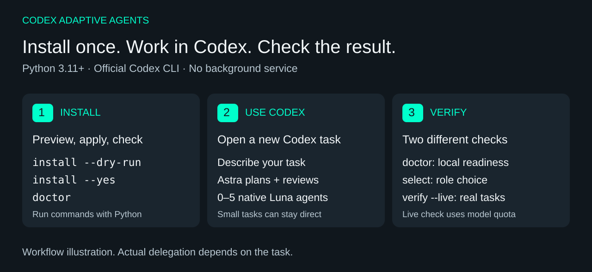
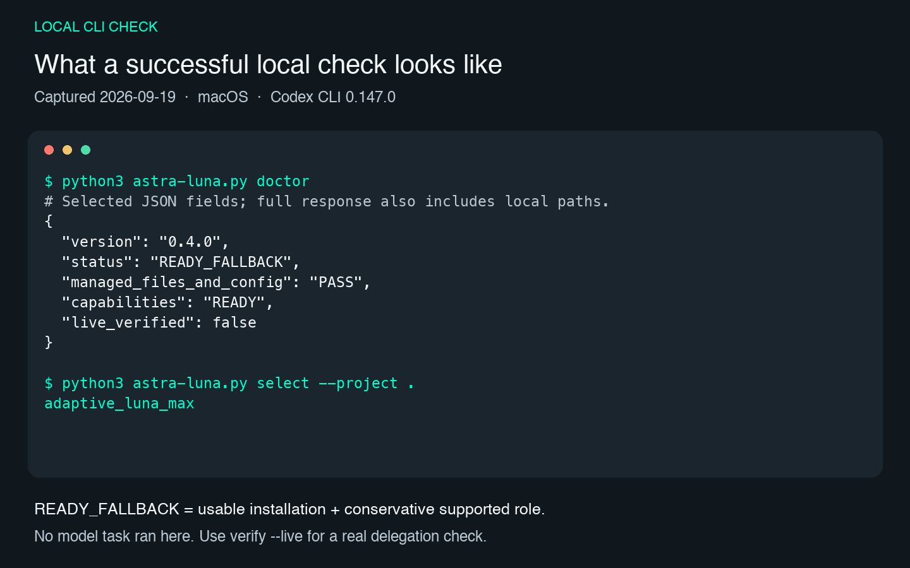

# Astra / Luna Native 0.4.0

[简体中文](README.zh-CN.md)

Astra / Luna Native is a small Python runtime and installer for the official
Codex CLI. It lets the Astra root agent choose a bounded Luna role when a task
is worth delegating, while the official Codex client keeps ownership of login,
provider access, and model execution.

Installation, policy selection, and verification are implemented in this
repository. No other agent-orchestration project is required. See the
[implementation and dependency details](docs/UPSTREAM.md).

After installation, continue to describe work in ordinary Codex tasks. Astra
plans and reviews the work, using 0–5 native Luna children when there are useful
independent subtasks. The package adds configuration and scripts to Codex;
it has no separate chat window and installs no background service or MCP server.

## Easiest setup: copy these prompts into Codex

Use a Codex client that can access your local files and run commands. Ask it to
install the project, then open a new task to verify the installation. Manual
commands are also included below.

### Step 1: ask Codex to install

This sets the managed Astra Max root defaults, Luna Max child defaults, five
roles, and project instructions while preserving unrelated configuration.

```text
Please install Astra / Luna Native for me:
https://github.com/aweiht/astra-luna-native

Clone or reuse a separate checkout, preserve existing edits, read README.md, and carry out the installation.
Check Python 3.11+, the official Codex CLI, and the required model catalogue. Use this Codex client's CODEX_HOME.
Run the commands below through the checkout's astra-luna.py entry, using python3 on macOS/Linux or py -3 on Windows.
I authorize this project's managed configuration, five Luna roles, instructions, and runtime, preserving other settings and backups.
Run install --dry-run, review its scope yourself, then apply install --yes --plan-id <plan_id> using the returned plan_id.
Run doctor; if only the capability snapshot or policy cache is stale, run refresh and check once more.
Actually complete the installation. If dependencies, login, permissions, or conflicts need my attention, explain the specific blocker.
Report the result and installation directory, then remind me to reopen Codex and start a new task for verification. Do not run verify --live in this step.
```

### Step 2: open a new Codex task and verify

This checks the local installation and role selection without starting an
extra model test. `READY` or `READY_FALLBACK` plus a successful selection means
the local installation check passed.

```text
Please verify my Astra / Luna Native installation:
https://github.com/aweiht/astra-luna-native

Locate astra-luna-native/runtime/astra-luna.py under this Codex client's CODEX_HOME.
Use Python 3.11+ to run doctor through that installed entry. If only the capability snapshot or policy cache is stale, refresh and check once more.
Run select --project <temporary-directory> --explain in a separate temporary directory and confirm it selects an installed adaptive_luna_* role.
Do not reinstall, modify business files, run verify --live, or treat role selection as a child-agent invocation.
Report “local installation check passed” only when doctor returns READY or READY_FALLBACK and selection succeeds.
Briefly show pass/fail, the actual status, selected role, and next step. Report the specific reason on failure.
```

To check whether Luna can actually execute tasks, use the separate
[optional live verification](#optional-live-verification), which uses real
Codex allowance.

## How the route works



_The workflow shows installation, daily policy selection, and bounded native
delegation. It is a usage overview, not evidence of a live model run._

The installer manages a small, explicit scope in the user's Codex home:

- Astra Max defaults to `gpt-6-astra` with `model_reasoning_effort = "max"`.
- Luna Max is configured as the default subagent: `gpt-5.6-luna` at `max`.
- Five role files are installed: `adaptive_luna_low`, `adaptive_luna_medium`,
  `adaptive_luna_high`, `adaptive_luna_xhigh`, and `adaptive_luna_max`.
- A daily policy cache chooses one of those roles from the local public model
  catalogue and the two public radar sources. No model call is used for this
  selection.

The installer changes the managed `model` and `agents` keys intentionally. It
preserves unrelated configuration, roles, MCP settings, hooks, and other files
outside that managed scope. Every write is planned, backed up, written
atomically, and verified; a conflicting managed change stops the transaction.

## Requirements

You need all of the following before applying an installation:

- Python 3.11 or newer. The runtime uses only the Python standard library; no
  pip package, Go compiler, or compiled binary is required.
- The official Codex CLI 0.147.0 or newer.
- A Codex client that supports native custom agents. Normal use and live
  verification require model access and available account allowance.
- A normally configured official Codex home and account whose public catalogue
  exposes `gpt-6-astra` with `max`, plus `gpt-5.6-luna` with all five levels:
  `low`, `medium`, `high`, `xhigh`, and `max`.

The installer reads the CLI's public version and model catalogue through
`codex --version` and `codex debug models`. It does not open authentication
files. A clone or downloaded ZIP does not guarantee that an account can use
the required models. A blank or isolated `CODEX_HOME` may have no matching
catalogue, in which case `install --yes` correctly refuses to proceed.

## Quick start

Clone the public repository and enter it. Alternatively, use GitHub's
**Code → Download ZIP**, extract the archive, and open a terminal there.
If Codex is not ready yet, follow the
[official CLI setup](https://developers.openai.com/codex/cli/) first:

```sh
git clone https://github.com/aweiht/astra-luna-native.git
cd astra-luna-native
```

On macOS or Linux, use `python3`:

```sh
python3 --version                 # must be 3.11 or newer
python3 astra-luna.py install --dry-run
python3 astra-luna.py install --yes
python3 astra-luna.py doctor
```

On Windows PowerShell, use the Python launcher. Make sure `py -3` resolves to
Python 3.11 or newer:

```powershell
py -3 --version
py -3 .\astra-luna.py install --dry-run
py -3 .\astra-luna.py install --yes
py -3 .\astra-luna.py doctor
```

`install --dry-run` prints the planned managed changes and does not write them.
`install --yes` applies the planned changes after checking the official CLI
and required public catalogue. If your Codex home is not the default, pass it
before the subcommand, for example:

```sh
python3 astra-luna.py --codex-home "/path/to/.codex" install --dry-run
python3 astra-luna.py --codex-home "/path/to/.codex" install --yes
```

After a successful `INSTALLED` result, open a new Codex task. Existing tasks
may still hold their startup instructions from before installation.

The installed entry point is
`<CODEX_HOME>/astra-luna-native/runtime/astra-luna.py`, so the download directory
can be moved later. Keep the Python interpreter path used during installation
available; the managed instructions refer to it.

## Use it in Codex

Open your project in a new Codex task and describe the outcome you need. For
example:

> Check this project's input validation and test coverage. Delegate useful,
> independent work to Luna, then review the changes and report the verification.

You do not need to start a worker or run the selector yourself. Small changes
can stay with the root agent. Independent work can run in parallel, with at
most five direct Luna children in one task. Before a delegation batch, the
managed instructions call the daily selector; external rankings are only a
selection aid and do not guarantee savings, speed, or task quality.

### Delegation gate

Before substantive work starts, Astra assesses the scope and expected payoff.
A work package must be evaluated when work crosses modules or layers, spans
multiple substantive files, contains multiple independent workflows, needs
cross-component debugging, or needs independent exploration, external
verification, implementation, testing, or review. If the package has an
explicit goal, file or problem ownership, and checkable acceptance, and its
expected value exceeds child startup, communication, and acceptance overhead,
Astra dispatches a native child when the host permits it. An explicit user
request to delegate is honored within those permissions; the root does not
merely describe a split or add a child after the work is done.

Direct completion is suitable for a simple single-point change, a repetitive
mechanical rename, a root-only decision, an inseparable dependency chain, or an
explicit no-delegation request. “Small” by itself does not waive a
cross-module assessment. Independent packages may run in parallel; dependent
packages run serially; a task uses no more than five direct Luna children.
Parallel work also needs non-conflicting browser, database, port, and output
resources. If an explicit worker count or parallel arrangement cannot be met
safely, explain the constraint and ask to adjust it rather than silently changing
the request. Architectural decisions stay with the root; useful independent
fact-checking can still be delegated.

| Situation | Route |
| --- | --- |
| Changes cross modules or layers and have separate ownership and acceptance | Delegate; run independent packages in parallel where useful |
| Two independent workflows or a cross-component investigation can be isolated | Delegate; use serial order when one package depends on another |
| One local typo, a mechanical rename, or a root-only decision without a useful independent check | Complete directly |
| A tightly coupled fix has no safe independent boundary | Complete directly, or reassess after a boundary appears |
| The user explicitly says not to delegate | Complete directly |

Reassess unfinished work when the scope expands, the original plan no longer
fits, troubleshooting repeats, or the task enters a new implementation or
verification phase. The daily selector only chooses a supported role level; it
does not decide whether to delegate or spawn agents, and it is not a timer or
scheduler. If the selector, role, or native tool fails, report the actual
returned error. Do not claim that a capability is unavailable without evidence,
and do not treat successful selection as a child-agent invocation. These are
instructions for the agent, not a host-enforced guarantee of delegation.

The final reply includes a compact execution summary, for example:

```text
Astra/Luna: direct · luna ×0
Astra/Luna: delegated · luna_max ×2 · parallel
```

These examples show the format, not a live run. Child levels and counts come
from actual dispatches; the root displays its known model name only. The
summary does not read or report the current window's reasoning-effort setting.
For substantive work, state the delegation or direct-completion reason in one
sentence in the plan or progress update. Keep this compact footer and do not
create a separate delegation report file.

## Installation scope and backups

The transaction may add or update these owned paths under the selected Codex
home:

- managed keys in `config.toml`;
- one marked, managed block in `AGENTS.md`;
- the five `agents/adaptive_luna_*.toml` role files;
- the runtime, installation receipt, capability snapshot, transaction journal,
  and private backups under `astra-luna-native/`.

Backups are kept under
`$CODEX_HOME/astra-luna-native/backups/` (or the equivalent Windows Codex
home). The receipt records hashes and the exact managed configuration changes.
The installer refuses to overwrite an unrelated change discovered during the
transaction, and rollback refuses to overwrite a newer concurrent change.

## Status and troubleshooting

`doctor` performs an offline post-install check. It checks managed hashes, the
installed entry point, the official CLI version, the saved public capability
snapshot, and the local policy cache. It does not call a model.

- `READY` means the installation and current local capability/policy state are
  usable.
- `READY_FALLBACK` means the installation is usable with the supported
  conservative Max role because comparable radar evidence was insufficient.
  Run `refresh` when the public sources are available; this status does not
  claim that a dynamic recommendation was proven.
- `NOT_READY` means the installation is absent or a required check failed. A
  clean Codex home normally reports this status.

Use the matching repair path:

- **Codex is missing or too old:** install or update the official CLI, run its
  normal `codex login`, then rerun `doctor`. If `codex` is not on `PATH`, pass
  `--codex /absolute/path/to/codex` to `install`, `doctor`, or `refresh`.
- **The public catalogue is missing Astra/Luna:** run `codex debug models` in
  the Codex home you intend to use. The required Astra Max and all five Luna
  levels must be present before `install --yes` can write anything. An empty
  isolated home cannot be used as a substitute for a working account.
- **The policy is stale or blocked:** refresh the public snapshot and inspect
  the selected role:

  ```sh
  python3 astra-luna.py refresh
  python3 astra-luna.py doctor
  python3 astra-luna.py select --project /path/to/project --explain
  ```

- **A managed conflict is reported:** keep the user's changed files, review
  the `install --dry-run` plan, and rerun after resolving the intended managed
  values. If a transaction was interrupted, use `recover --yes`; it restores
  only the recorded transaction when its hashes still match.
- **A task does not use the new route:** start a new Codex task after the
  install. The managed block is loaded when a task starts.

To inspect the selected role, use `select`:

```sh
python3 astra-luna.py select --project /path/to/project
python3 astra-luna.py select --project /path/to/project --explain
```

`select` chooses a role and does not start a child agent. The project policy
cache lives in `.astra-luna/state`; add `.astra-luna/` to
the project's ignore file. `select` may refresh once per local day. `refresh`
explicitly updates the public capability snapshot and policy inputs; neither
command invokes a model.



_This typeset image presents actual `doctor` and `select` output from an existing
local installation on 2026-09-19, with private paths omitted. It shows local
checks; it is not a Codex screenshot or evidence of a live model task._

## Optional live verification

For a real native task check, copy this prompt into Codex:

```text
Please run one live native-delegation check for my Astra / Luna Native installation.
I authorize this verify --live run to use real Codex allowance: at most two direct Luna children, a 600-second limit, and no automatic retry.
Use the installed script under the current CODEX_HOME. Run doctor first, and run verify --live only if it passes.
Let the command create its default isolated temporary verification directory; preserve the results and do not use an existing business directory.
Inspect the command result and artifacts. Report a live pass only for LIVE_VERIFIED; otherwise explain the failure.
Give the local result, live result, and evidence-file location. Do not substitute role selection or model self-reports for execution evidence.
```

Offline tests and live model verification are separate checks. Run the offline
tests without consuming model allowance:

```sh
python3 -m unittest discover -s tests_python -p 'test_*.py' -v
```

On Windows PowerShell:

```powershell
py -3 -m unittest discover -s tests_python -p "test_*.py" -v
```

Only when you have a working account and want to spend real Codex allowance,
run the explicit live check:

```sh
python3 astra-luna.py verify --live \
  --project /path/to/smoke-project \
  --output /path/to/verification-output
```

The command uses a temporary official stdio test channel, starts at most two
direct native Luna children, and is bounded at 600 seconds. A complete,
independently checked run returns `LIVE_VERIFIED`. It may consume real quota;
do not treat it as a default installation step. The temporary channel is not
an installed MCP server, daemon, Hook, scheduler, or resident process.

## Validation boundary

The public release has a 6/6 cross-platform CI result across macOS, Linux, and
Windows with Python 3.11 and 3.13. Those CI jobs cover source tests, the
allowlisted ZIP, and isolated lifecycle checks. Linux and Windows checks use
fake public client/model data for the lifecycle; historical real native model
task evidence is macOS-only. See [docs/VALIDATION.md](docs/VALIDATION.md) for
the observed evidence and its limits.

## Update, recovery, and uninstall

To update a Git checkout, pull the source and apply the managed installation
again:

```sh
git pull --ff-only
python3 astra-luna.py install --dry-run
python3 astra-luna.py install --yes
```

Use the same entry point and Codex home:

```sh
python3 astra-luna.py uninstall --dry-run
python3 astra-luna.py uninstall --yes
python3 astra-luna.py recover --yes
python3 astra-luna.py rollback --backup PATH --yes
```

`uninstall --yes` removes the owned runtime and managed role files, reverts the
managed instruction block and configuration changes, and preserves unrelated
user changes. The managed receipt and backup history remain available under
the resource directory. `recover` is for a journal marked `applying`; use the
backup path recorded by the transaction for an exact rollback.

## Build and license

The release builder uses the checked-in allowlist and refuses unsafe archive
members, broken public Markdown links, private paths, and overwriting an
existing archive:

```sh
python3 scripts/release_python.py --output-dir dist/0.4.0-python
```

The project is distributed under the [Apache License 2.0](LICENSE). See
[NOTICE](NOTICE), [docs/PUBLIC_GUIDE.md](docs/PUBLIC_GUIDE.md),
[docs/VALIDATION.md](docs/VALIDATION.md), [SECURITY.md](SECURITY.md), and
[CONTRIBUTING.md](CONTRIBUTING.md) for public operating, validation, security,
and contribution details.

This is an independent community project, not an official OpenAI product.
