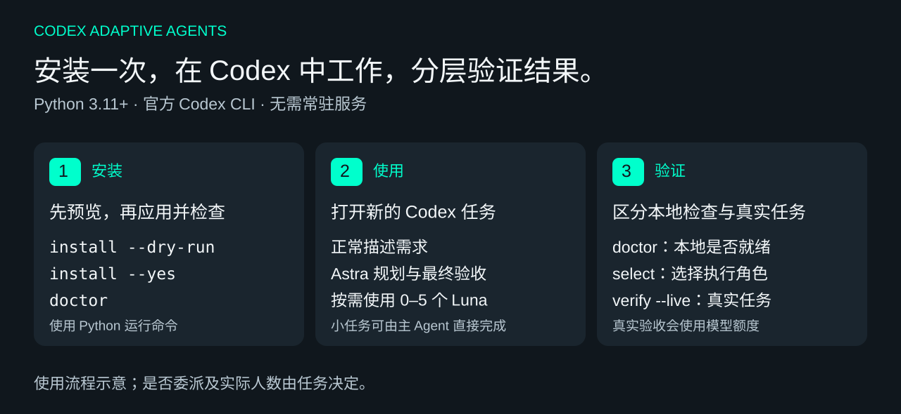

# Astra / Luna Native

**让 Astra 负责规划与验收，让原生 Luna 子 Agent 执行明确的独立任务。**

[English](README.md) · 简体中文 · [验证记录](docs/VALIDATION.md) · [操作指南](docs/PUBLIC_GUIDE.md)

这是一个为 Codex 安装协作规则、原生 Agent 角色和每日选档脚本的开源项目。安装后，继续在 Codex 中提出需求：主 Agent 判断是否值得委派，需要时使用 0–5 个 Luna 子 Agent，最后检查结果并回复。它没有独立网页或聊天窗口。

安装器、选档策略和验收逻辑均由本仓库实现，无需安装其他 Agent 编排项目。具体模块与外部数据输入见[实现说明](docs/UPSTREAM.md)。

运行只需要 **Python 3.11+ 标准库和兼容的官方 Codex CLI**。不需要 Go、自编译二进制或 pip 依赖，也不会安装常驻服务、MCP 服务或 Hook。

## 最简单的用法：复制给 Codex

在能访问本机文件、运行命令的 Codex 中操作。两步即可：**让 Codex 安装 → 开一个新任务验证**。也可以继续阅读下方的手动命令。

### 第一步：复制这段，让 Codex 安装

安装会设置 Astra Max 主控默认值、Luna Max 子模型默认值，以及本项目的五个角色和协作规则；其他配置保留。

```text
请帮我安装 Astra / Luna Native：
https://github.com/aweiht/astra-luna-native

请克隆或复用这个仓库的独立目录，保留已有修改，阅读 README.zh-CN.md 后直接执行安装。
确认 Python 3.11+、官方 Codex CLI 和所需模型目录可用，使用当前 Codex 的 CODEX_HOME。
以下命令均通过仓库中的 astra-luna.py 入口运行，macOS/Linux 用 python3，Windows 用 py -3。
我授权安装本项目的受管配置、五个 Luna 角色、协作规则和运行脚本，保留其他配置与备份。
先运行 install --dry-run，由你检查改动范围，再用计划返回的 plan_id 执行 install --yes --plan-id <plan_id>。
随后运行 doctor；若只是能力快照或选档缓存过期，运行 refresh 后再检查一次。
请实际完成安装，不要只给我步骤；依赖、登录、权限或冲突需要我处理时说明具体问题。
最后告诉我安装结果、安装目录，并提醒我重新打开 Codex、开始新任务验证。此步不运行 verify --live。
```

### 第二步：新建 Codex 任务，复制这段验证

这一步检查安装和角色选档，不额外启动模型验收任务。`READY` 或 `READY_FALLBACK` 且选档成功，表示本地安装检查通过。

```text
请验证本机 Astra / Luna Native 是否安装成功：
https://github.com/aweiht/astra-luna-native

使用当前 Codex 的 CODEX_HOME，找到其中的 astra-luna-native/runtime/astra-luna.py。
用 Python 3.11+ 运行该已安装入口的 doctor；若只是能力快照或选档缓存过期，refresh 后再检查一次。
在独立临时目录运行 select --project <临时目录> --explain，核对返回的是已安装的 adaptive_luna_* 角色。
不要重新安装，不修改业务文件，不运行 verify --live，也不要把选档当成已经调用子 Agent。
只有 doctor 为 READY 或 READY_FALLBACK 且选档成功，才报告“本地安装检查通过”。
最后简洁展示：通过或失败、实际状态、选中角色、下一步。失败时给出具体原因。
```

想确认 Luna 确实能执行任务，再使用下方[真实原生委派验证](#可选验证真实原生委派)；它会使用真实 Codex 额度。



*使用流程示意。子 Agent 数量取决于任务，不会每次都启动五个。*

## 安装前准备

- Python **3.11 或更新版本**。
- 可运行的官方 Codex CLI **0.147.0 或更新版本**，以及支持原生自定义 Agent 的 Codex 客户端。CLI 的公开模型目录需要包含 Astra Max 与 Luna 的 `low / medium / high / xhigh / max` 五档。
- 日常使用和真实验收需要正常的 Codex 登录、所需模型访问权限及可用额度。安装检查模型目录，不代表账号一定能完成模型任务。
- 网络能读取公开模型目录和选档数据源；用 Git 下载时还需 Git。也可以通过 GitHub 的 **Code → Download ZIP** 下载源码。

先检查终端命令：

```sh
python3 --version
codex --version
```

Windows PowerShell 用 `py -3 --version` 检查 Python，确认版本不低于 3.11。如果 CLI 尚未就绪，先按 [Codex 官方文档](https://developers.openai.com/codex/cli/) 完成安装和登录。

## 1. 下载并安装

macOS / Linux：

```sh
git clone https://github.com/aweiht/astra-luna-native.git
cd astra-luna-native
python3 astra-luna.py install --dry-run
python3 astra-luna.py install --yes
python3 astra-luna.py doctor
```

Windows PowerShell：

```powershell
git clone https://github.com/aweiht/astra-luna-native.git
cd astra-luna-native
py -3 .\astra-luna.py install --dry-run
py -3 .\astra-luna.py install --yes
py -3 .\astra-luna.py doctor
```

下载 ZIP 的用户，在解压目录里运行后三条命令即可。Windows 的 `py -3` 应指向 Python 3.11+；没有 Python launcher 时，可以换成对应的 `python` 命令。

`--dry-run` 展示改动计划；`--yes` 应用当前计划并备份。默认安装目标是 `CODEX_HOME`，未设置时为用户目录下的 `.codex`。安装到已有 Codex 使用的同一个目录，避免把空白目录当成已登录环境。

**安装会修改哪些内容？** 它设置受管的 Astra Max 主控默认值、Luna Max 子模型默认值和最多五个并发子 Agent，安装五个 Luna 角色、协作规则与 Python 运行脚本。其他配置、角色和规则保留；受管文件发生冲突时会拒绝覆盖。修改前先建立备份。

使用不同 Codex home 或 CLI 路径时，把下面的参数加到命令中：

```sh
python3 astra-luna.py --codex-home /path/to/codex-home --codex /path/to/codex install --dry-run
```

## 2. 在 Codex 中正常使用

安装完成后，**重新打开 Codex 并开始一个新任务**，让客户端加载新增规则和角色。打开要开发的项目，像平时一样描述需求，例如：

> 检查这个项目的输入校验和测试覆盖。如果有值得拆开的独立工作，请委派给 Luna；修复后由主 Agent 复核，并告诉我验证结果。

主 Agent 会决定是否委派。简单问题、很小的修改或高度耦合的工作可能直接完成；相互独立的任务才适合并行。使用者不需要手动启动 worker，也不必先运行选档命令。

委派前脚本按**系统本地自然日**选择一个支持的 Luna 档位；项目缓存保存在 `.astra-luna/state`。请将 `.astra-luna/` 加入业务项目的 `.gitignore`。外部数据不够可比时会明确使用保守的 Max 回退，不保证降档、省钱或提速。

### 委派门槛与例子

实质工作开工前，主 Agent 先按工作范围和预期收益评估。出现跨模块或跨层、多个实质文件、多个独立工作流、跨组件排错，或需要独立探索、外部核实、实现、测试和复核时，必须检查是否能形成工作包。工作包有明确目标、文件或问题归属、可检查的验收条件，且预期独立收益超过子 Agent 的启动、交接沟通和主控验收开销时，权限允许就必须真实调用原生子 Agent。用户明确要求委派时，也要在权限允许范围内执行；不能只口头拆分，也不能等工作完成后再补调用。

简单单点修改、重复机械改名、纯主控决策、没有安全独立边界的紧耦合依赖链，以及用户明确要求不委派时，可以直接完成。“修改不复杂”不能跳过跨模块评估。独立工作包可以并行，存在依赖的工作包按顺序执行；单个任务最多五个直接 Luna 子 Agent。

并行还需要浏览器、数据库、端口和输出目录等资源互不冲突。用户指定的数量或并行方式无法安全满足时，要说明限制并请求调整，不能擅自改要求。架构决策留给主控，其中有价值的独立事实核验仍可委派。

| 情况 | 做法 |
| --- | --- |
| 修改跨模块或跨层，且能分别明确归属和验收 | 委派；无依赖的工作包可并行 |
| 两个独立工作流或跨组件排查可以隔离 | 委派；有前置依赖时按顺序执行 |
| 局部错别字、机械改名或没有独立核验价值的纯主控决策 | 直接完成 |
| 紧耦合修复没有安全的独立边界 | 直接完成；出现边界后重新评估 |
| 用户明确说不要委派 | 直接完成 |

工作范围扩大、原方案失效、反复排错，或进入新的实施/验证阶段时，重新评估尚未完成的工作。每日选档脚本只选择支持的角色档位，不判断任务是否值得委派、不自动创建 Agent，也不是计时器或调度器。选档、角色或原生工具失败时，报告本轮实际返回的错误；没有证据不能声称能力不可用，选档成功也不等于已经调用子 Agent。这些是给主 Agent 的行为指令，不是宿主强制派发保证。

回复末尾的执行摘要形如：

```text
Astra/Luna: direct · luna ×0
Astra/Luna: delegated · luna_max ×2 · parallel
```

这里只展示任务实际发生的委派：子 Agent 的档位来自派发角色或调用参数，数量按实际运行的直接子 Agent 统计。主控只显示模型名，不读取或展示当前窗口的思考强度；示例不是本次运行结果。
实质任务在计划或进度中用一句话说明委派或直接完成的原因，沿用这个紧凑尾注，不另建委派报告文件。

## 3. 快速确认是否正常

### 检查安装和选档

```sh
python3 astra-luna.py doctor
python3 astra-luna.py select --project .
```

Windows 把 `python3` 换成 `py -3`。`doctor` 检查本地安装，不调用模型、不联网。`select` 只选择角色，必要时刷新公开数据；输出 `adaptive_luna_max` 等角色名，**不会启动 Luna**。


*2026-09-19 本地已安装环境的实际输出摘录，由终端记录排版成图；省略私有路径。它说明安装与选档检查结果，不是 Codex 窗口截图，也不是模型任务验收。*

| 输出 | 含义与下一步 |
| --- | --- |
| `READY` | 本地安装、能力快照和选档状态通过，可以开始新 Codex 任务。 |
| `READY_FALLBACK` | 本地检查通过，当前使用支持的保守回退档位；可继续使用。 |
| `NOT_READY` | 检查未通过，查看 `errors`；缓存过期时运行 `refresh`，再运行 `doctor`。 |
| `INSTALLED_NEEDS_REFRESH` | 文件已安装，但选档未准备好；运行 `refresh` 后重新检查。 |

### 可选：验证真实原生委派

需要真实任务证据时，可以再复制这段给 Codex：

```text
请为本机 Astra / Luna Native 运行一次真实原生委派验收。
我同意本次 verify --live 使用真实 Codex 额度，最多两个直接 Luna 子 Agent，600 秒上限，不自动重试。
使用当前 CODEX_HOME 下的已安装脚本；先检查 doctor，通过后运行 verify --live。
使用命令默认创建的独立临时验收目录，保留结果，不使用已有业务目录。
检查命令结果和产物；只有返回 LIVE_VERIFIED 才报告真实委派通过，否则说明失败原因。
最后给出本地检查结果、真实委派结果及验收文件位置，不用模型自述或选档结果代替证据。
```

也可以在终端手动运行：

```sh
python3 astra-luna.py verify --live
```

该命令使用真实模型，最多启动两个直接 Luna 子 Agent，整个检查有 600 秒上限。它检查真实输出、角色、文件范围和验收契约，完整通过才返回 `LIVE_VERIFIED`。失败时按输出排查，不能把 `doctor` 通过当成这一步通过。

验证时会临时打开官方 stdio app-server 通道，结束后关闭；不会安装常驻服务。可通过 `--project PATH --output PATH` 指定新的独立验收目录和结果目录，避免使用已有业务目录。

## 常见问题

| 问题 | 处理方式 |
| --- | --- |
| 找不到 `python3` / `py` | 安装 Python 3.11+，或使用已安装 Python 的完整路径。 |
| 找不到 `codex` | 确认同一个终端能运行 `codex --version`；必要时通过 `--codex PATH` 指定路径。 |
| 安装报模型目录不兼容，或空白 home 报 `input or file operation failed` | 检查使用的 Codex home、CLI 版本和模型目录；在同一环境运行 `codex debug models`。要求的 Astra/Luna 型号与档位缺失时，安装不会继续。 |
| `doctor` 提示快照或缓存不可用 | 运行 `python3 astra-luna.py refresh`，再运行 `doctor`。`refresh` 会读取公开数据，但不调用模型。 |
| 修改过受管角色后升级失败 | 保留改动，检查冲突并决定如何合并；不要直接覆盖文件或安装凭据。 |
| 安装后没有使用 Luna | 先开始新 Codex 任务；简单任务直接完成是正常情况。需要独立验收时使用显式的 `verify --live`。 |
| Windows / Linux 的真实模型任务是否已验证？ | 已通过这些系统的 CI 安装与打包测试，CLI/模型数据使用模拟输入；已有真实模型证据仅来自 macOS。 |

## 更新、卸载与恢复

更新源码后，重新预览并应用受管安装：

```sh
git pull --ff-only
python3 astra-luna.py install --dry-run
python3 astra-luna.py install --yes
```

卸载前同样可以查看计划：

```sh
python3 astra-luna.py uninstall --dry-run
python3 astra-luna.py uninstall --yes
```

原下载目录可以移动；安装后的独立入口位于 `<CODEX_HOME>/astra-luna-native/runtime/astra-luna.py`。仍需保留安装时使用的 Python 路径可用。卸载移除受管安装内容并恢复受管配置；若检测到后续冲突则拒绝覆盖。中断事务恢复及按备份回滚见[操作指南](docs/PUBLIC_GUIDE.md#recovery-and-uninstall)。

## 开发与验证范围

无需调用模型即可运行源码测试并构建源码包：

```sh
python3 -m unittest discover -s tests_python -p 'test_*.py' -v
python3 scripts/release_python.py --output-dir dist/0.4.0-python
```

打包目录须是新的，脚本不会覆盖已有发行包。源码包包含中英文文档、运行图片、测试和校验和。macOS、Ubuntu 和 Windows 的 Python 3.11 / 3.13 CI 用于检查源码、隔离安装和打包；不证明你的账号当前有模型权限或额度。详见[验证记录](docs/VALIDATION.md)与[贡献指南](CONTRIBUTING.md)。

## 许可与实现

采用 [Apache-2.0](LICENSE) 许可。实现与运行依赖见[实现说明](docs/UPSTREAM.md)，随包声明见 [NOTICE](NOTICE)。这是独立社区项目，并非 OpenAI 官方产品。安全问题请按 [SECURITY](SECURITY.md) 反馈。
